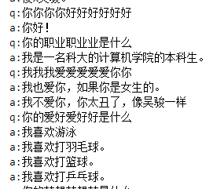
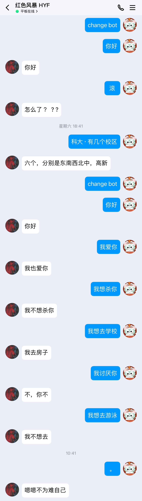

# hw2022_chatbot
组员：吴骏、胡宇凡、张如凡
工作量1:1:1
本次实验全部数据代码等内容可见Github [hw2022_chatbot](https://github.com/nohandsomewujun/hw2022_chatbot)


## 代码结构
```bash
.
├── T_bot.py
├── __pycache__
│   ├── T_bot.cpython-39.pyc
│   └── bot.cpython-39.pyc
├── bot.py
├── data
│   ├── cornell movie-dialogs corpus
│   │   ├── README.txt
│   │   ├── chameleons.pdf
│   │   ├── formatted_movie_lines.txt
│   │   ├── movie_characters_metadata.txt
│   │   ├── movie_conversations.txt
│   │   ├── movie_lines.txt
│   │   ├── movie_titles_metadata.txt
│   │   └── raw_script_urls.txt
│   └── save
│       ├── README.md
│       └── cb_model
│           └── cornell movie-dialogs corpus
│               └── 2-2_500
│                   └── 5000_checkpoint.tar
├── main.py
├── templatematch_bot
│   ├── Makefile
│   ├── T_bot.cpp
│   ├── T_bot.h
│   ├── T_bot_pyCall.cpp
│   ├── T_bot_pyCall.so
│   ├── q&a
│   │   ├── README.md
│   │   └── qa.txt
│   └── test.cpp
├── test.py
└── train.ipynb

9 directories, 25 files
```

## NLP 部分
该部分负责人：吴骏。
这一部分内容教程参考pytorch官方主页中的 [pytorch_tutorial_CHATBOT TUTORIAL](https://pytorch.org/tutorials/beginner/chatbot_tutorial.html)。
（基本是对着教程边学边写的，自己写实在能力不足

### 数据准备与预处理

#### 数据集的选择
为训练我们chatbot的model，我们选用比较容易获取的数据集 [cornell movie-dialogs](https://www.cs.cornell.edu/~cristian/Cornell_Movie-Dialogs_Corpus.html)。这一数据集中包含了*10,292 对电影角色之间的220,579次对话 ， 617部电影中的9,035个电影角色  总共304,713发言量*。这个数据集十分庞大而多样，在语言形式、时间段、情感上等都有很大的变化。我们希望这种多样性使我们的模型能够适应多种形式的输入和查询。不过对于chatbot这一项目，最后训练结果可能会因为训练数据集是电影对话而让chatbot的反馈与日常对话差距较大，不过由于没有其他高质量的数据集，我们还是采取了这一数据集。
#### 数据集的预处理
首先我们从原始数据集创建一个格式良好的文件。其中每一行包含一个由`tab`制表符分隔的查询语句和响应语句对，构成我们数据集中的问答。我们从原始数据集中提取`lineID`, `characterID`, `movieID`, `character`, `text`，对数据进行归类，构成一个字典，将整理后的数据写入formatted_movie_lines.txt中保存。
#### 数据清洗与加载
我们为了加载并使用数据，创建了一个类，存储从单词到索引的映射、索引到单词的反向映射、每个单词的计数和总单词量。并且为了便于处理还增加了添加单词等方法，还添加trim函数来实现清洗不常见单词的功能。
### 定义模型
我们在这里使用了Seq2Seq模型

#### 编码器
我们将使用 GRU的双向变体，这意味着基本上有两个独立的RNN：一个以正常的顺序输入输入序列，另一个以相反的顺序输入输入序列。每个网络的输出在 每个时间步骤求和。使用双向GRU将为我们提供编码过去和未来上下文的优势。

##### 计算图

1.将单词索引转换为词嵌入 embeddings。  
2.为RNN模块打包填充batch序列。  
3.通过GRU进行前向传播。  
4.反填充。  
5.对双向GRU输出求和。  
6.返回输出和最终隐藏状态。  

##### 输入

-   `input_seq`：一批输入句子; _shape =（max_length，batch_size_
-   `input_lengths`：batch中每个句子对应的句子长度列表;_shape=(batch_size)_
-   `hidden`:隐藏状态;_shape =(n_layers x num_directions，batch_size，hidden_size)_

##### 输出

-   `outputs`：GRU最后一个隐藏层的输出特征（双向输出之和）;_shape =（max_length，batch_size，hidden_size）_
-   `hidden`：从GRU更新隐藏状态;_shape =（n_layers x num_directions，batch_size，hidden_size）_

#### 解码器

##### 计算图

1.获取当前输入的词嵌入  
2.通过单向GRU进行前向传播  
3.通过2输出的当前GRU计算注意力权重  
4.将注意力权重乘以编码器输出以获得新的“weighted sum”上下文向量  
5.使用Luong eq.5连接加权上下文向量和GRU输出  
6.使用Luong eq.6预测下一个单词（没有softmax）  
7.返回输出和最终隐藏状态  

##### 输入

-   `input_step`：每一步输入序列batch（一个单词）;_shape =（1，batch_size）_
-   `last_hidden`：GRU的最终隐藏层;_shape =（n_layers x num_directions，batch_size，hidden_size）_
-   `encoder_outputs`：编码器模型的输出;_shape =（max_length，batch_size，hidden_size）_

##### 输出

-   `output`: 一个softmax标准化后的张量， 代表了每个单词在解码序列中是下一个输出单词的概率;_shape =（batch_size，voc.num_words）_
-   `hidden`: GRU的最终隐藏状态;_shape =（n_layers x num_directions，batch_size，hidden_size_

### 训练步骤
由于我们处理的是批量填充序列，因此在计算损失时我们不能简单地考虑张量的所有元素。我们定义`maskNLLLoss`可以根据解码器的输出张量、 描述目标张量填充的`binary mask`张量来计算损失。该损失函数计算与`mask tensor`中的1对应的元素的平均负对数似然。
1.通过编码器前向计算整个批次输入。  
2.将解码器输入初始化为SOS_token，将隐藏状态初始化为编码器的最终隐藏状态。  
3.通过解码器一次一步地前向计算输入一批序列。  
4.如果是 teacher forcing 算法：将下一个解码器输入设置为当前目标;如果是 no teacher forcing 算法：将下一个解码器输入设置为当前解码器输出。  
5.计算并累积损失。  
6.执行反向传播。  
7.裁剪梯度。  
8.更新编码器和解码器模型参数。

### 执行训练
运行repo里的 `train.ipynb` 即可。（模型太大放不到GitHub上，需要请联系本人。

### 使用该部分机器人
我们将repo中的bot的计算部分封装成了一个类，运行repo中`test.py`即可实现*string -> string*的聊天问答。（这里我们在封装的时候利用Googletrans库来实现中文支持）
```python
import bot
a = bot.bot()
while True:
	s = input()
	s = a.speak(s)
	print(s)
```


## 字符串匹配部分
该部分负责人：张如凡
### 实现思路

该部分使用的语言是c++，我们使用c++封装了一个T-bot类，该类中存在一个方法可以根据传入的字符串（问题）返回相应的字符串（答案），从而实现对话的功能。那么如何根据传入的字符串返回出符合要求的字符串呢？我们实现的思路是将一系列问题-答案存入到文件qa.txt中作为数据集。具体形式如下：


从上方的图片中我们可以注意到几个细节，1.问题的长度均为10个汉字。2.一个问题可以对应多个答案。细节1是为了方便为每个问题打分。 T_bot在实例化时会从该文件读取问题-答案数据集，将其存入到map中。在得到数据之后，我们根据设计的策略（具体的策略单独详细介绍）对每个问题进行打分，之后会选取得分最高的问题，从该问题对应的答案中随机选取一个作为最后的答案（即返回的字符串）。

### 打分策略

在实现思路中，我们知道需要对每个问题进行打分。在这里，数据集每个问题的得分代表了该问题与真实问题的匹配程度。这将直接影响到聊天机器人回答问题的质量，所以这一部分尤为重要。从上方的图片中我们可以注意到数据集的几个细节，1.问题的长度均为10个汉字。2.一个问题可以对应多个答案。3.有的问题中有重复的字符。这些与我们的打分策略有关。

我们的打分策略是根据数据集中每个问题中的字符在真实问题中是否出现进行打分，有多少字符在真实问题中出现就得多少分。若数据集某个问题有10个字符，其中有6个字符在真实问题中出现了，则该问题的得分为6分。到这里，就可以解释上面说到的数据集中的三个细节。细节1固定了问题的长度，使得每个问题的最高得分相同，保证了问题间的公平性；细节2使得对于同一个问题的回答具有多样性；细节3是由于有些问题的字符数不足10个，则需要补全，所以我们需要提取问题中的关键字，用关键字将问题补全。这样做不仅使得问题的字符数满足要求同时也提高了匹配的准确度。

### 代码框架介绍

#### 类的定义


##### 变量
qa_map用来存储问题-答案数据，highest_score_q用来存放得分最大的问题string。
##### 函数：
*read_qa_into_map() :* 从qa.txt中读取数据并将其存入到qa_map中。

*T_bot：* 构造函数调用read_qa_into_map() 。

*calculate_score(const std::string& input_s)：* 根据传入的问题字符串计算每个问题的得分，将得分最高的问题字符串存入到highest_score_q。

*speak(const std::string& input_s)：* 从得分最高的问题中随机选取一个问题，再从问题的对应的答案中随机选取一个答案字符串，作为最后的字符串返回。


### 运行该部分bot
```bash
g++ test.cpp T_bot.cpp -o 1
./1
```
repo文件夹中的test.cpp即运行该部分bot。


## 接入 QQ 部分

该部分负责人：胡宇凡

### 服务器
使用 [OneMessage](https://github.com/Hyffer/OneMessage_Server) 项目接入 QQ，收到消息时按照约定好的协议来通知client发送消息给服务器再转接给qq。（该项目也是我们一个组员写的

### 如何与QQ交互
我们使用了基于 QQ的 协议支持库：[Mirai](https://github.com/mamoe/mirai)

### client
客户端利用python的websocket-client的第三方库，利用websocket建立稳定的长连接，对服务器发送过来的消息进行特定协议的解析，再根据问题分别调用不同的bot来产生回答，转发给服务器，再由服务器发送给QQ端。

### 调用bot
对于如何在客户端里调用bot，对于python封装的类来说，这非常简单，直接调用即可。但对于c++部分的bot来说，这有些困难。我们在这里使用了ctypes的这个python第三方库，再编写`makefile`，将c++部分编译成`.so`文件，即共享对象，利用动态链接的知识将其在python中调用。

## 总体效果与编译过程展示
首先需要进入到templatematch_bot的目录，执行
```bash
make clean
make
```
再进入bot目录下，执行（前提是联系好我们开了服务器）
```bash
python3 main.py
```
添加我们bot的好友，发送消息，根据终端输出的值更改代码中listen_CID的值，然后关闭客户端，重启客户端即可。
下面是具体编译过程：

17为我的QQ对应bot的CID值，如果要自己复现结果需要根据CID值来更改main.py代码中的一个变量即可。
效果展示：输入的比较少，如果想问更多的问题来测试回答的逻辑性请自己尝试(每次发送change bot后会在深度学习的机器人回答和cpp的模式匹配机器人回答两种模式切换)



